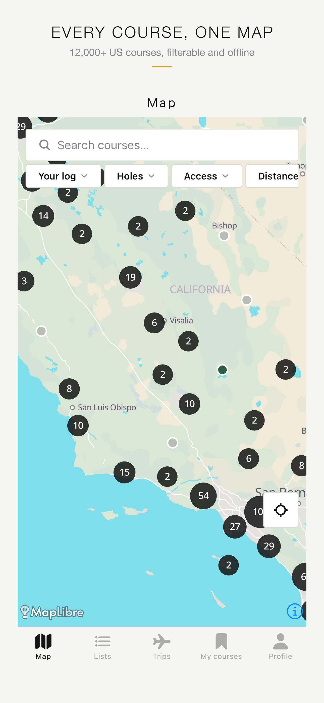
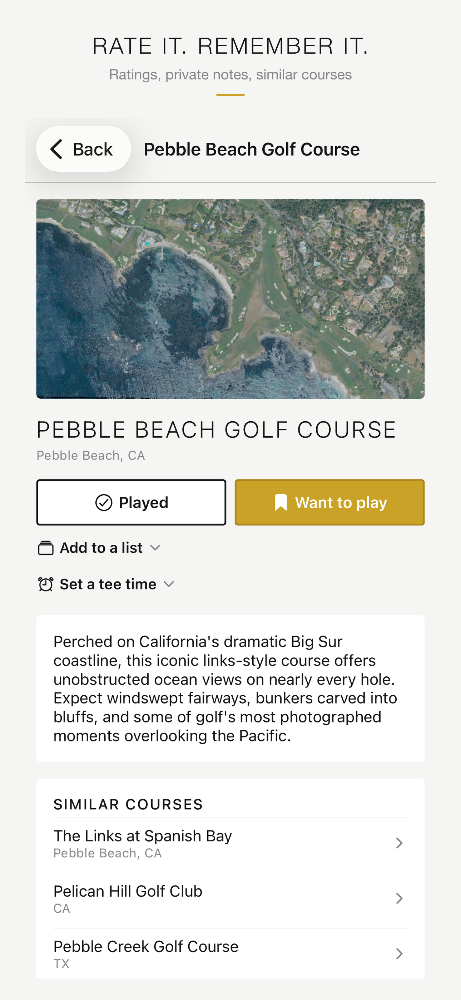
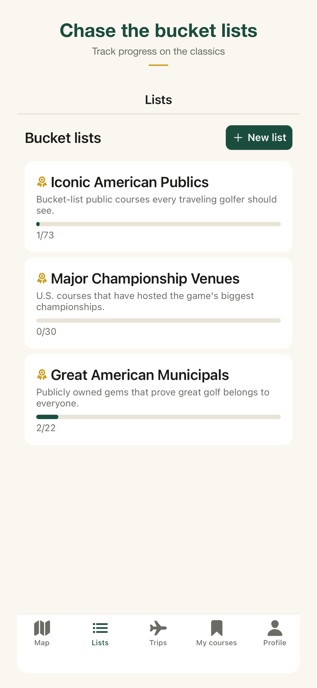

# Marker: Golf

**A "Letterboxd for golf courses."** Explore and map every course in the US, log where you’ve played, build bucket lists, and plan golf trips with a grounded AI planner.

Marker is built as a domain-agnostic engine + skin: the engine owns reusable product behavior, including maps, discovery, lists, profiles, planning, and data interfaces, while the skin (in this case, golf) supplies the domain-specific vocabulary, attributes, theme, and data.

<p align="center">
  
  
  
  
  
</p>

## Highlights

| | |
|---|---|
| **12,640 US courses** | Built with my own ETL (OpenStreetMap + Overture, enriched with Wikidata, elevation, wind, season and USGS aerials). It matched a hand-labelled ground-truth set 50/50. |
| **AI trip planner** | Retrieval happens first and validation happens after, so the model can *choose* courses but can not *invent*. An end-to-end eval runs against the deployed function and passes 48/48, with zero non-database courses, zero price claims, and every turn of a multi-turn refinement re-validated. |
| **Flat infrastructure cost** | No metered map or places APIs. The basemap is a single PMTiles file on Cloudflare R2, pins are clustered on the device, and descriptions and embeddings are batch-precomputed once. The only per-user AI call is gated behind the subscription. |
| **Security by construction** | Every user table uses Postgres row-level security, backed by SQL isolation tests. Entitlements are written only by the server-side RevenueCat webhook. There is also a community e2e suite that passes 23/23 against production with two real accounts. |
| **Engine / skin separation** | The engine code is forbidden from using golf vocabulary, and a purity lint in `pnpm verify` enforces the rule. Adding a new niche (ski resorts, surf breaks, national parks) means writing a new skin package and an ETL adapter. |

## How the planner can't hallucinate

```
free-text brief ──► parse (LLM, strict JSON schema)
                ──► retrieve 15–40 real candidates (PostGIS + pgvector, our code, not the LLM)
                ──► compose itinerary from candidate IDs only (LLM)
                ──► validate: unknown IDs dropped, untraceable numbers rejected,
                    region checked against an independent geographic fixture
                ──► render from database IDs, never from model prose
```

When a request is impossible (for example, dates that fall outside the region's playing season), the planner declines honestly. It tells the user the reason and suggests a playable window instead of returning a plan that would be wrong. For the full reasoning, see [`docs/architecture.md`](docs/architecture.md#33-how-the-trip-planner-cannot-hallucinate) and the eval harness in [`tooling/eval/plan-trip-eval.mjs`](tooling/eval/plan-trip-eval.mjs).

## Stack

**App:** Expo (React Native) · TypeScript · expo-router · MapLibre
**Backend:** Supabase (Postgres, PostGIS, pgvector, Auth, Edge Functions) · Cloudflare Workers + R2
**AI:** Claude (Haiku for the planner, Batch API for grounded descriptions) · local embeddings
**Monetization:** RevenueCat · **Tooling:** pnpm workspaces · EAS Build

## Repository layout

```
apps/mobile          the engine app (Expo), niche-agnostic and lint-enforced
packages/core        skin contract + domain types
packages/skins/golf  vocabulary, theme, attribute schema, curated lists
tooling/etl          course data pipeline: extract → transform → enrich → load
tooling/eval         end-to-end grounding + community evals
supabase/            17 migrations, RLS isolation tests, edge functions
infra/tile-worker    edge-cached tile/photo/privacy worker
docs/                architecture, decision records, data-quality + eval reports
```

## How it was built

I wrote the architecture plan and the decision records, then directed a small team of Claude sub-agents (mobile, backend, data, AI, release-ops and a reviewer; see [`.claude/agents`](.claude/agents)) against them, using security reviews and evals as the gates between milestones. The commit history is written to be read. Messages explain *why* a change was made, including cases where an earlier fix didn't work.

## Running it

See [`docs/DEVELOPMENT.md`](docs/DEVELOPMENT.md).

## Data attribution

Course data © [OpenStreetMap](https://www.openstreetmap.org/copyright) contributors (ODbL) and the [Overture Maps Foundation](https://overturemaps.org/). Aerial imagery comes from USGS NAIP (public domain). Additional facts come from [Wikidata](https://www.wikidata.org/) (CC0).
